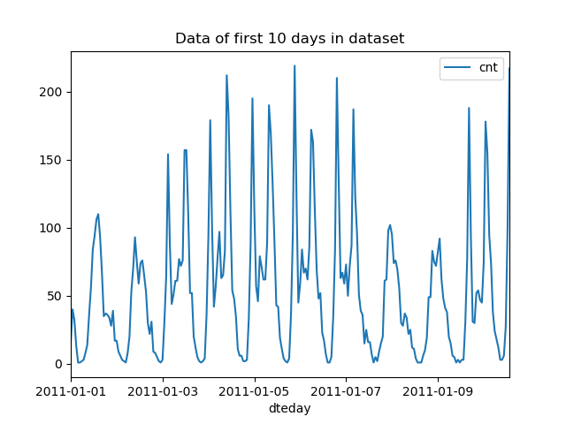
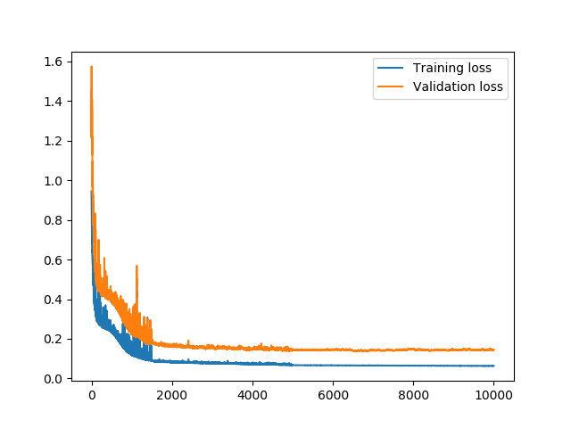
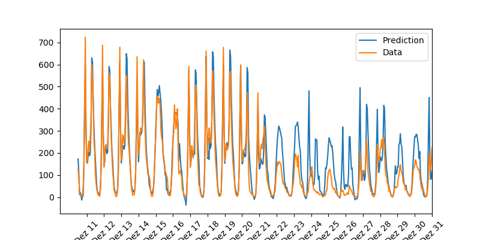
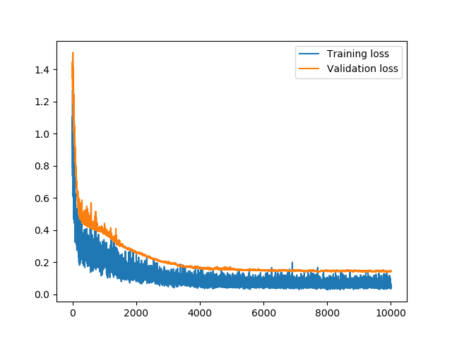
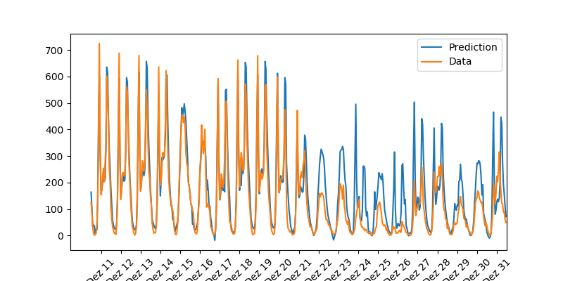

# 2-5_project_1_predicting_bike_sharing_patterns

## STOP! If you are taking the Nano Degree program, try to solve the project by yourself first!

## Quick Start

### Download the bike-sharing dataset

Inside this folder execute the following commands:

```
mkdir Bike-Sharing-Dataset && cd Bike-Sharing-Dataset
wget https://raw.githubusercontent.com/udacity/deep-learning-v2-pytorch/master/project-bikesharing/Bike-Sharing-Dataset/Readme.txt
wget https://raw.githubusercontent.com/udacity/deep-learning-v2-pytorch/master/project-bikesharing/Bike-Sharing-Dataset/day.csv
wget https://raw.githubusercontent.com/udacity/deep-learning-v2-pytorch/master/project-bikesharing/Bike-Sharing-Dataset/hour.csv
```

### Execute the provided script

Originally, the project had to be solved without PyTorch. Execute the original solution with this command:

```
cd project_1_orig
python main.py
```

I provide a second version that is almost the same, but uses PyTorch. You can run this second version with 

```
cd project_1_pytorch
python main.py
```

## Description

The dataset in this project is small enough to be trained on the CPU.

In both versions you can adjust the hyperparameters at the end of the file __my_answers.py__.
Note that I additionally added a varying learning rate, which was not part of the original task.
You can find it in the training loop in the files __main.py__ in both versions.

When running either of the versions you will first see a plot of the data of the first 10 days in the dataset:



Training starts after you close the window with the dataset visualization.

### Original Project Implementation

For the __original implementation__ you will see a continuous training progress that will result in something like this:

```
Progress: 15.0% ... Training loss: 0.089 ... Validation loss: 0.184
  reducing learning rate from 1.0 to 0.5
Progress: 50.0% ... Training loss: 0.067 ... Validation loss: 0.144
  reducing learning rate from 0.5 to 0.1
Progress: 100.0% ... Training loss: 0.063 ... Validation loss: 0.145
----------------- losses after last step ---------------
training loss: 0.063
validation loss: 0.145
```

One of the requirements in the project was to achieve a validation loss below 0.18, which is the case here.
After training, a window with a plot of the training loss and validation loss will be displayed:



After closing this window you also see a plot of the original data and the prediction made by the trained model:




### PyTorch Project Implementation

For the __PyTorch implementation__ you will see a continuous training progress that will result in something like this:

```
Progress: 15.0% ... Training loss: 0.192 ... Validation loss: 0.319
  reducing learning rate from 0.25 to 0.1
Progress: 50.0% ... Training loss: 0.072 ... Validation loss: 0.153
  reducing learning rate from 0.1 to 0.05
Progress: 100.0% ... Training loss: 0.054 ... Validation loss: 0.144
----------------- losses after last step ---------------
training loss: 0.054
validation loss: 0.144

```
Note the different learning rates compared to the original implementation.

After training, a window with a plot of the training loss and validation loss will be displayed:



After closing this window you also see a plot of the original data and the prediction made by the trained model:




